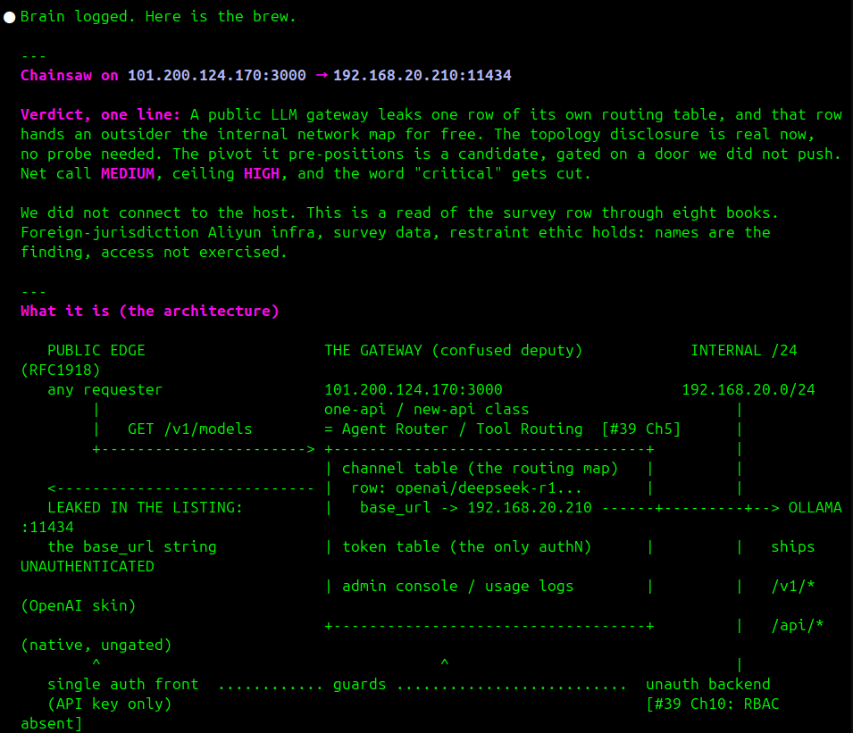
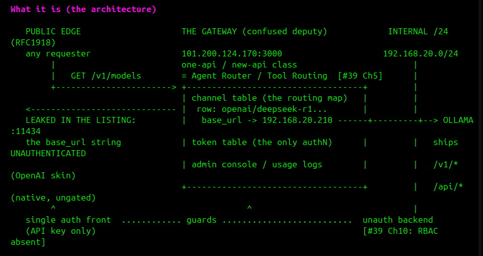
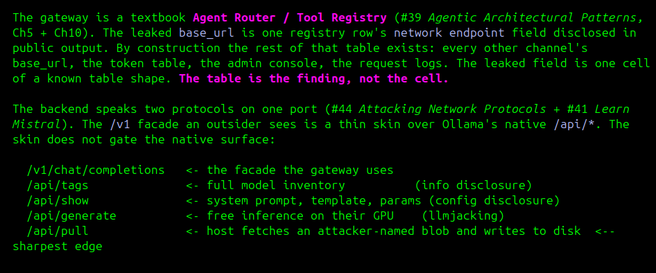
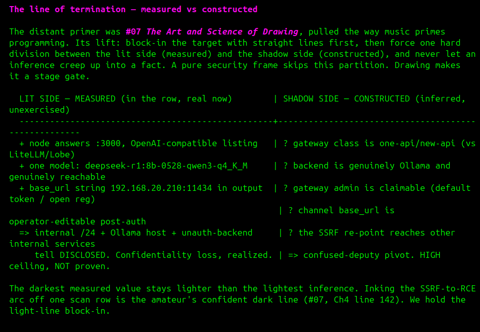
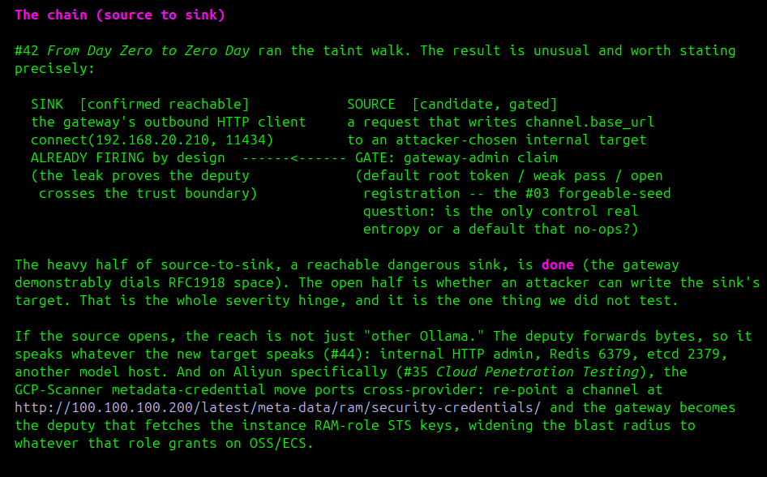
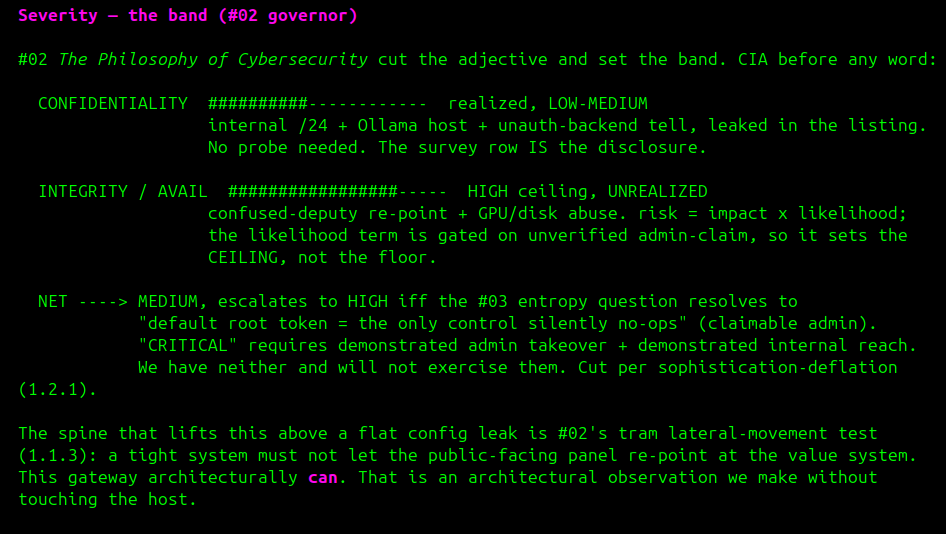
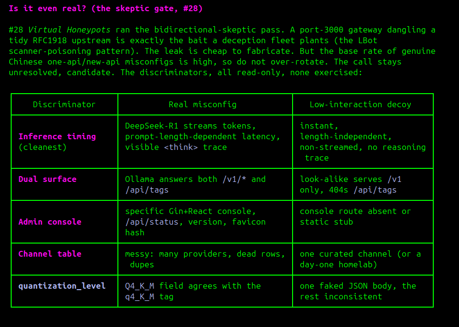
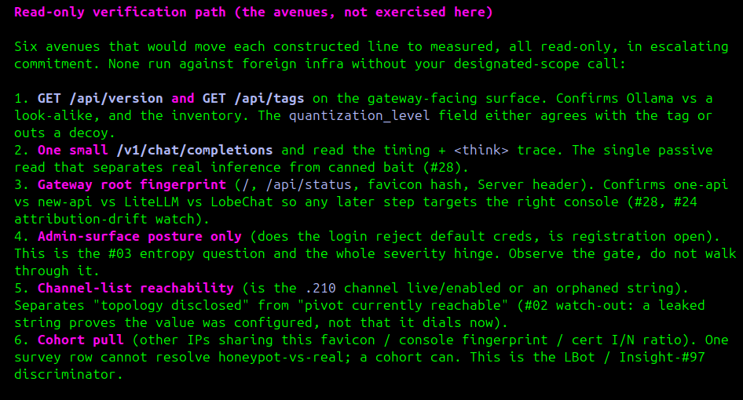
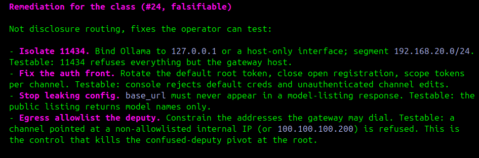
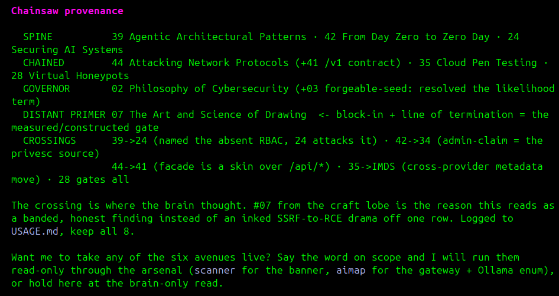

# Chainsaw

A loadable, collective brain built from 65 books, read cover to cover, with
their **full text kept available** as the substance. The distilled cards,
lobes, and framework are the map on top. The books are the territory.

Chainsaw is not a reading list and not a pile of summaries. It is one brain,
built so the books reinforce each other. You load it as context and it makes
every skill sharper, because every part feeds every other part.

> The name is the growth model. A chainsaw carves. We keep all 65 books in full
> now, and over time we cut away what usage shows we do not need (USAGE.md).
> Private repo: the full texts live here, with us, not in public.

## The one claim

Using the 65 books as a collective improves every single skill each of them
teaches. They are not applied one at a time. They compound.

```
creative writing   <-->  vulnerability research
hacking / exploit  <-->  leadership
creative thinking  <-->  software programming
        ...and every other pair, both directions. they all help each other.
```

The creative-writing books sharpen how you tell the story of a finding. The
exploit books sharpen how a leader thinks about risk and pressure. The drawing
and photography books sharpen recon, because recon is trained observation. The
conversation and persuasion books sharpen disclosure. The randomness book
sharpens fuzzing. None of this works if you read one book and shelve it. It
works when the whole brain is loaded and the parts talk.

## How it thinks (like a brain)

A human brain does not look up one fact and stop. Small traces of information,
memory traces, fire together and brew. A melody loosens a stuck function. A sketch
unlocks a recon angle. Distant parts prime each other, and the answer comes
from the combination, not the lookup.

Chainsaw works that way. Each card is a small unit, a trace, and it points at the
full book behind it. Loading one fires its neighbors through the chain links,
which are the synapses. Distant domains are wired to prime each other on
purpose: music to programming, drawing to recon, exploitation to leadership.
The brain is most useful when you let an unrelated part brew with the task.

## Full context, no shortcuts

The full text of all 65 books is in the brain. We did not replace the books
with summaries, because a summary pre-decides what matters before we have any
evidence of what matters. When a task pulls a book, it pulls the full text. The
card just tells you which book and where to look.

We keep everything now because we do not yet know what works and what does not.
Usage carves the brain over time: what fires in real research earns its keep,
what never fires gets a pruning decision, later, on evidence, not opinion. See
USAGE.md.

## Flat weight (no best book)

Every book counts the same. There is no flagship, no core, no tier. A lobe with
two books is not lesser than a lobe with eighteen; that is domain size, not
importance. They improve each other equally and in every direction, so the
brain is a full mesh, not a hub with spokes. Nothing here ranks the 65.

## How it was built

Same construction the wardrobe used on the cyber-pathway tool catalog: take a
catalog, distill each item into a small composable unit, then assemble units
into task-shaped sets on demand. There the units were outfits. Here they are
cards over full books. You do not load the whole library; you pull the books
the task calls for and chain them across racks.

```
65 books read in full
   -> full text retained (books/)                        THE SUBSTANCE
   -> per-book synthesis (read-proof + structure)        the read layer
      -> per-book BRAIN CARD (map: which book, when, what it chains with)
         -> 7 LOBE doctrines (how each domain acts as one capability)
            -> 1 FRAMEWORK (the collective doctrine, always-on)
```

## Architecture

```
THE TERRITORY (substance)        THE MAP (navigation)            THE LOADER (context)
books/  x65                      FRAMEWORK.md  (always-on)       load/SKILL.md
  full text of every book          the collective doctrine         /chainsaw <task> -> picks the
  the part that helps may be      brain/INDEX.md                    book(s) from the map, loads
  the part no summary kept          signal -> lobe -> book          their FULL TEXT, brews
                                    + the chain map (synapses)
syntheses/  x65                  brain/lobes/*.md  x7             load/AGENT.md
  proof-of-read + structure        through-line + moves +          a think-tank subagent,
  per book                         collective lift per domain      grounded in the full brain
                                 brain/cards/*.md  x65
                                   reach-for-when / principles /  CLAUDE.md
                                   moves / chains / watch-out      drop the repo into a project,
                                   (the index into full text)      framework self-loads
```

## The seven lobes

All 65 books placed, no overlap. Lobes keep token weight sane; they do not wall
the books off. The framework and the chain links cross every wall.

```
offensive   (18): 12 15 17 25 30 32 34 35 42 43 44 46 47 48 49 50 53 54
defensive   (12): 13 16 24 26 28 29 31 33 36 37 51 52
ai-agentic   (8): 03 20 21 27 38 39 40 41
craft-code   (6): 04 06 07 08 18 23
human        (8): 05 09 10 11 14 19 22 45
philosophy   (2): 01 02
bio-compute (11): 55 56 57 58 59 60 61 62 63 64 65
```

## How to load the brain

1. FRAMEWORK.md is always-on. Read it first. It is the operating system.
2. Read brain/INDEX.md. Match the task to its lobe(s) and books by signal.
3. Load the FULL TEXT of the one to three books the task names, from books/.
   The card says which book and which sections; the book is what you read.
4. Follow the synapses. Each card points at sibling books, including across
   lobes. Pull their full text when the task touches them.
5. For a hard problem, deliberately load one DISTANT book the task would not
   obviously call for, the way music helps programming. State why.
6. Brew, then act. The answer comes from the combination of full contexts.

```
$ /chainsaw map attack surface on an unknown industrial protocol
  map says: offensive (44, 42, 30) + defensive (26, 31, 28) + craft (07) + human (19)
  loads:    the FULL TEXT of the books the task actually needs, brews them
```

## The tool (chainsaw CLI)

The brain is also a thin command-line tool, on PATH as `chainsaw`. It routes,
serves full text, logs what fires, surfaces prune candidates, and ingests new
books. It never summarizes in place of a book; the brew stays in the model.

```
chainsaw route "<task>"   lobe(s) + book numbers + full-text paths + 1 priming pick
chainsaw read <NN[-MM]>   cat the full text of a book (territory, not the map)
chainsaw list [lobe]      the manifest
chainsaw fire <NN..> --task T --lift L   append a USAGE.md fire-log row
chainsaw prune            books with zero fires (the prune-by-usage engine)
chainsaw add <pdf> --lobe L --title T    slot a new book (additive)
```

`route` is the index step made mechanical. `read` is the one rule made
executable: it serves the book, not the card. `fire` and `prune` run the
keep-everything-prune-by-usage growth model from USAGE.md. `add` plus a distill
pass is how books 46-54 entered the brain.

## See it think (a worked brew)

One real task: a public LLM gateway leaks one row of its own routing table,
and that row hands an outsider the internal network map. The brain reads the
single survey row through eight books across four lobes. No probe, no connect.
This is the one claim made visible: the books are not applied one at a time,
they brew together, and the answer comes from the crossing.

The brew, in the order the brain produced it.

**Verdict and what it is.** Lead with the answer, then the architecture the
finding implies. The leaked field is one cell of a known table shape, so the
table is the finding, not the cell.





**The distant primer (#07 craft lobe) draws the line.** *The Art and Science
of Drawing* is pulled the way music primes programming. Its lift: block in the
target, then force one hard division between the measured side and the
constructed side, and never let an inference creep up into a fact.



**The spine walks source to sink (#42, #39, #24).** *From Day Zero to Zero
Day* runs the taint walk. The reachable dangerous sink is done; the open half
is whether an attacker can write its target, and that is the severity hinge we
did not test.



**The governor sets the band (#02).** *The Philosophy of Cybersecurity* cuts
the adjective and sets the band by CIA before any word. MEDIUM, escalates to
HIGH on the entropy question, and "critical" gets cut for want of proof.



**The skeptic gate (#28).** *Virtual Honeypots* runs the bidirectional skeptic
pass. A tidy port-3000 gateway over RFC1918 is exactly the bait a deception
fleet plants, so the call stays a candidate with read-only discriminators.



**The avenues and the fix.** Six read-only verification paths, none exercised
without a scope call, and a falsifiable remediation for the class (#24).




**Provenance.** The brain shows its work: the spine, the chained books, the
governor, the distant primer, and the crossings where the thinking happened.
The craft book from a non-security lobe is the reason this reads as a banded,
honest finding instead of an inked drama off one scan row.



## Provenance and boundary

Built by Nuclide (Nick + Claude) from the "Research-N" O'Reilly Learning
playlist, 65 books read in full. The full texts and syntheses are copyrighted
O'Reilly content. This is a PRIVATE repo: the full texts live here with the map
so the brain is whole in one place. Keep it private. Do not make it public and
do not mirror the book text anywhere public.

## Repo map

```
README.md            this file
FRAMEWORK.md         the collective doctrine (always-on)
USAGE.md             the growth model: keep everything, prune by usage
books/               full text of all 65 books            (private)
syntheses/           per-book read-proof + structure      (private)
brain/
  INDEX.md           router: signal -> lobe -> book, plus the chain map
  lobes/             7 lobe doctrines
  cards/             65 navigation cards (index into full text)
load/
  SKILL.md           the /chainsaw loader skill
  AGENT.md           the think-tank subagent
docs/
  brew/              a worked brew, screenshots of the brain thinking
CLAUDE.md            repo-level self-loader
```
